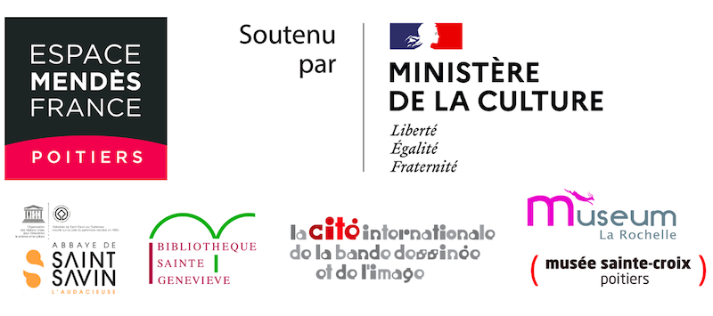

Adno is led by the [Espace Mendès France](https://emf.fr) a center for scientific, technical and industrial culture located in Poitiers and which operates throughout the Nouvelle-Aquitaine region (France). It is developing in partnership with [Abbey of Saint-Savin-sur-Gartempe and the valley of frescoes](https://www.abbaye-saint-savin.fr/), the [Bibliothèque Sainte-Geneviève](https://www.bsg.univ-paris3.fr/iguana/www.main.cls), Paris, the [Cité internationale de la bande dessinée et de l'image](http://www.citebd.org/), Angoulême, the [Museums of Poitiers](https://www.poitiers.fr/c__231_977__accueil_musee_sainte_croix.html), the [Natural History Museum of La Rochelle](https://museum.larochelle.fr/). Adno was selected as one of the sixteen winners of the 2022 edition of the call for [innovative digital services projects](https://www.culture.gouv.fr/Presse/Communiques-de-presse/Resultats-de-l-appel-a-projets-Services-numeriques-innovants-2022) by the french Ministry of Culture.

Adno is developed and supported by [Serli](https://www.serli.com/).

[Project presentation](/fr/blog/pr%C3%A9sentation-du-projet/EspaceMendesFrance_PresentationProjet.pdf)

__[More information in the French version of this page](/fr/docs/prologue/about/)__
