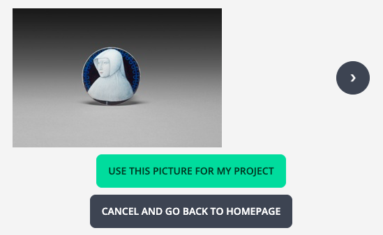
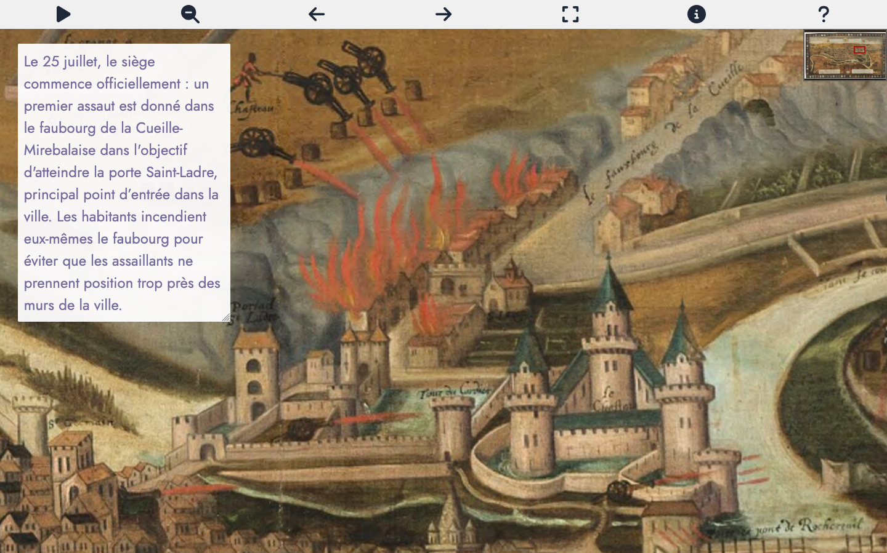
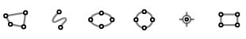
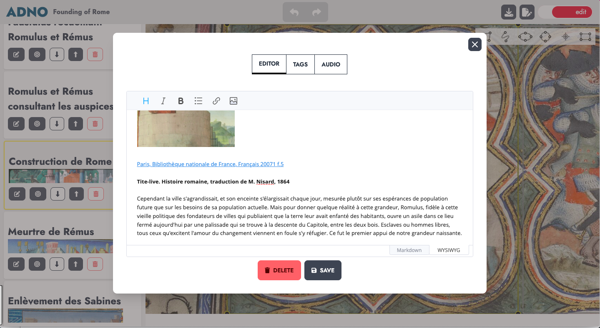

## An online service 

The easiest way to get started is to use the [online service](https://w.adno.app). It is free and does not require registration. You can also start with [an example](/example).

<a href="https://w.adno.app" target="_blank"><button type="button" class="btn btn-primary">Get started!</button></a>
<a href="/example" target="_blank"><button type="button" class="btn btn-success">Examples</button></a>

As Adno is free software, you can also install it for yourself and others. The sources and installation instructions are available on [Github](https://github.com/adnodev/adno).


Adno is under development, its features and interface are subject to change.


## Start a project 

The Adno home screen is divided into three areas.

The first is a simple form, the second, next to it, allows you to load an existing project, and the third, below it, lists the projects stored by the browser.


It allows you to:

- **create a project** by entering the URL of a static image, an IIIF image or manifest, or that of an Adno project,,
- **import a project** by loading an Adno project file.
- **retrieve a project** a previously created project stored in your browser.


For each existing project in the browser, a series of buttons allows access to the following features:

- **<i class="fa-solid fa-eye"></i> Preview**
- **<i class="fa-solid fa-pen-to-square"></i> Edit**
- **<i class="fa-solid fa-copy"></i> Duplicate**
- **<i class="fa-solid fa-download"></i> Download**
- **<i class="fa-solid fa-trash"></i> Delete**

### Start with a static image

The image in `png` or `jpg` format must be on the Internet permanently and you must know its address (the URL). Enter this URL in the dedicated field and click on `Create my project`. 

<button class="btn btn-copy"></button>
``` 
https://upload.wikimedia.org/wikipedia/commons/f/f3/Chenille_de_Grand_porte_queue_%28macaon%29.jpg
```

### Start with an IIIF resource 

If you're not familiar with IIIF or if you want to learn more, you can check out the [IIIF Online workshop](https://training.iiif.io/iiif-online-workshop/) provided by the [IIIF consortium](https://iiif.o) and led by Glen Robson.

You can start with an IIIF manifest or an IIIF image.

#### IIIF Manifest

This is a URL provided by the document publisher. The manifest describes the document with its metadata and images.

<button class="btn btn-copy"></button>
```
https://api.artic.edu/api/v1/artworks/251131/manifest.json
```

If there are several images, select one.



#### IIIF Image

You then use the direct url of an IIIF image, ending with `info.json`. 

<button class="btn btn-copy"></button>
```
https://gallica.bnf.fr/iiif/ark:/12148/btv1b8626777x/f13/info.json
```

### Start with an example

The [examples page](/en/example/) suggests resources from various domains. 

### Import a project

Use the Import a project button (`Importer un projet`) to upload a previously downloaded Adno file.

## View and edit your project 

The same interface lets you alternately and simply **view** and **edit** a project by clicking on the colored edit or playback button at the top right of the interface.

### Viewing interface


The navigation bar contains, on the left, Adno to return to the dashboard and project information, and, on the right, a button to switch from play mode to edit mode, as well as three buttons:

- **<i class="fa-solid fa-download"></i>** project export,,
- **<i class="fa-solid fa-file"></i>** displays all the project metadata,
- **<i class="fa-solid fa-gear"></i>** set viewer settings:
  - View
    - overall viewer,
    - display the toolbar.
    - display the toolbar in full screen mode,
    - display the navigation bar for annotations.
  - Navigation
    - delay between two annotations (default 5 seconds),
    - always start autoplay at the first annotation,
    - display annotation outlines,
    - display an icon inside the annotations,
    - audio rendering mode
    - activate image rotation.
  - Annotation
    - select the annotations to display based on one or more keywords,
    - annotation thickness,
    - annotation outline colours.

The image is placed in the rest of the screen, with the list of annotations to the left of the image and a number of icons above it.

- **<i class="fa-solid fa-play"></i> Autoplay** of annotations (see settings), 
- **<i class="fa-solid fa-magnifying-glass-minus"></i> Back** to the beginning of the annotation 
- **<i class="fa-solid fa-eye"></i>** / **<i class="fa-solid fa-eye-slash"></i> Show** / **Hide** annotation outlines,
- **<i class="fa-solid fa-arrow-left"></i> Previous annotation**,
- **<i class="fa-solid fa-arrow-right"></i> Next annotation**,
- **<i class="fa-solid fa-expand"></i> fullscreen**,
- **<i class="fa-solid fa-circle-info"></i> Information**,
- **<i class="fa-solid fa-question"></i> Help**.

Actions to access each annotation from the annotation list: 

- **<small>READ MORE</small> <i class="fa-solid fa-circle-plus"></i> View** the annotation content in a modal window, 
- **<i class="fa-solid fa-bullseye"></i> Focus** on the annotation area,

#### Full screen view

In full-screen view, only the current annotation is visible. You can set whether or not icons are displayed.



#### Keyboard shortcuts

- Key `p` or `P` to start the autoplay,
- Key `e` or `E` to toggle FullScreen,
- Key `s` or `S` to toggle annotation bounds,
- Key `t` or `T` to toggle the toolsbar,
- Key <code><i class="fa-solid fa-arrow-left"></i></code> and <code><i class="fa-solid fa-arrow-right"></i></code> to move from the current annotation to the previous or the next one.

### Editing interface


The navigation bar contains project information on the left, buttons for undoing or redoing last actions in the centre, and a button for switching from edit mode to playback mode on the right, as well as a button for saving the project and another for editing project information.

- **<i class="fa-solid fa-reply "></i>** cancel the last action,
- **<i class="fa-solid fa-share"></i>** restore the cancelled action,
- **<i class="fa-solid fa-download"></i>** export project,
- **<i class="fa-solid fa-file"></i>** edit project metadata.

To create a new annotation choose an annotation form:



Then select an area on the image by clicking and dragging. The editing interface appears to write the annotation.

To modify the content of an existing annotation, click on it. To resize it, move on the circles at the corners.

Actions to manage each annotation from the annotation list:

- **<i class="fa-solid fa-pen-to-square"></i> Edit** this annotation,
- **<i class="fa-solid fa-bullseye"></i> Focus** on the annotation area,
- **<i class="fa-solid fa-up-long"></i> <i class="fa-solid fa-down-long"></i> Move** the annotation into the list of annotations,
- **<i class="fa-solid fa-trash"></i> Delete** the annotation.

#### Edit an annotation



This modal window has three tabs:

- **Editor** for editing the annotation,
- **Tags** to associate keywords with the annotation,
- **Audio** to associate an audio resource with the annotation.

##### Editor interface (default)

The content of an annotation is generally a short text. However, it is possible to insert enriched content.

Two editing modes are available:

- [WYSIWYG](https://en.wikipedia.org/wiki/What_you_see_is_what_you_get) with icons (title levels, italics, bold, bulleted list, hypertext link, image),
- [Markdown](https://en.wikipedia.org/wiki/Markdown) a lightweight text mark-up system, which is how annotation content is represented.

##### Tags management

This tab allows you to associate one or more keywords with each annotation. You can select an existing keyword or create a new one. Remember to press the Enter key after entering each keyword.

In the playback settings, it is then possible to view routes by keyword.

##### Associating audio

This tab allows you to associate an audio resource with the annotation. The first field contains the URL of the audio file and the second contains information about the resource (credit or other).

In the playback parameters, specify how the audio is played, individually or in spatialized sound.

## Retrieve your projects 

Projects are stored in the local storage of your browser. You will be able to find them by reopening a session on the site from which they were created.


In private browsing projects are "forgotten" when you close your session. The same can happen with a restrictive setting of your browser.


## Share your projects

The button **<i class="fas fa-download"></i>**, which appears in various places in the Adno interface, provides this modal window showing how to save and share a project, by exporting it in the format of an Adno file or an IIIF manifest.

Start by downloading your Adno project. It takes the form of a simple text file in [json format](https://json.org).

This file is generally light. So you can easily send it by e-mail. Your correspondent will then be able to visualize it, as well as make variations or corrections.

You can also place your file online and distribute its URL. To do this, you can use a website or file server. The IPFS protocol provides an interesting decentralized alternative.

Once your Adno project is online, you can make it visible on a web page by inserting an `iframe` tag and adjusting the parameters below.

```
<iframe
    src="https://w.adno.app/#/embed?url=URL HERE"
    height="600px"
    width="100%"
    allow="fullscreen"
></iframe>

```

Note that by inserting the URL of an IIIF or non-IIIF image, or an IIIF manifest, you can obtain an IIIF viewer.

[Adno views tags](https://github.com/adnodev/adno-views-tag) allows you to embed different types of visualization in your web pages.

## Help 

Check the frequently asked questions and the documentation to learn more (beware! these parts are still incomplete). If you have any problems or suggestions, please [contact us](/contact).

