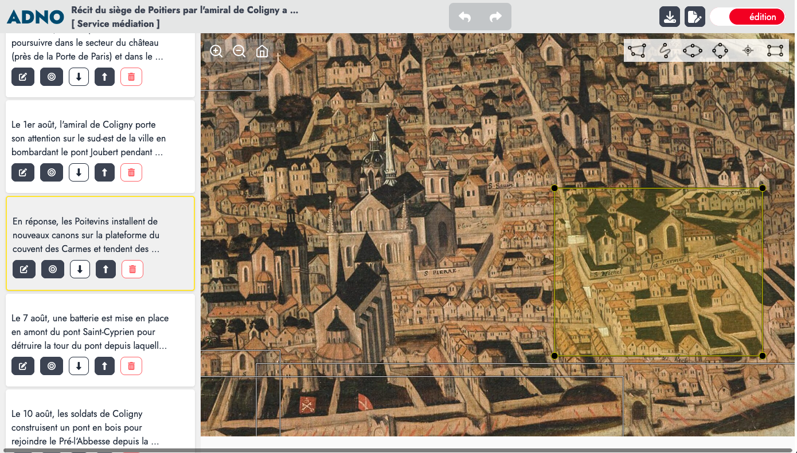
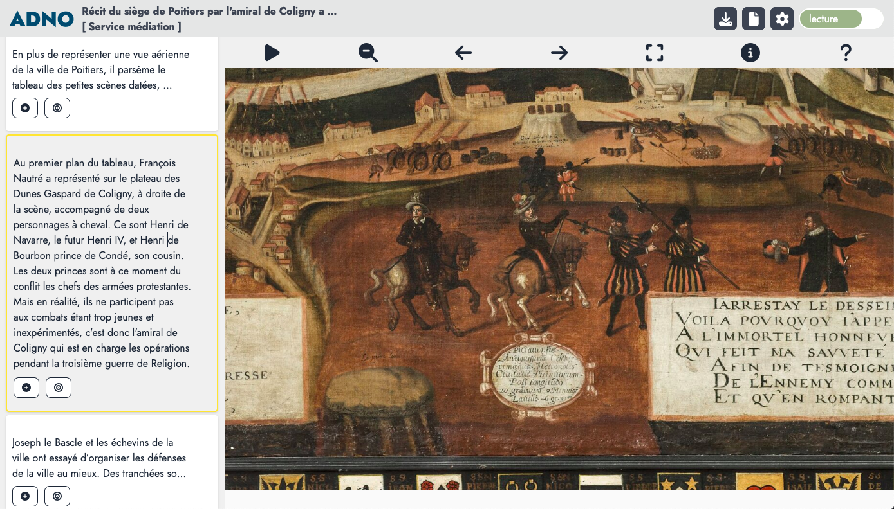

## An online service 

The easiest way to get started is to use the [online service](https://w.adno.app). It is free and does not require registration. You can also start with [an example](/example).

<a href="https://w.adno.app" target="_blank"><button type="button" class="btn btn-primary">Get started!</button></a>
<a href="/example" target="_blank"><button type="button" class="btn btn-success">Examples</button></a>

As Adno is free software, you can also install it for yourself and others. The sources and installation instructions are available on [Github](https://github.com/adnodev/adno).


Adno is under development, its features and interface are subject to change.


## Starting a project 

Adno's home page is a simple form.


It allows you to:

- **create a project** (green button) by entering the URL of a static image or an IIIF image,
- **import a project** (gray button) by loading an Adno project file.

This home page displays the list of projects created in this session of your browser.


### Starting with a static image

The image in `png` or `jpg` format must be on the Internet permanently and you must know its address (the URL). Enter this URL in the dedicated field and click on `Create my project`. 

<button class="btn btn-copy"></button>
``` 
https://upload.wikimedia.org/wikipedia/commons/f/f3/Chenille_de_Grand_porte_queue_%28macaon%29.jpg
```

### Starting with an IIIF image

If you don't know IIIF, read some information on [iiif.io](https://iiif.io). 

You can use :

- the direct url of an IIIF image, it ends with info.json
- the url of a document, a IIIF manifest, however currently only the first image is taken into account.

<button class="btn btn-copy"></button>
```
https://free.iiifhosting.com/iiif/1c8d49343676a04fffcd92979c02e9394e48bac96f590fffbadffc9133cd06b9/info.json
```

<button class="btn btn-copy"></button>
```
https://gallica.bnf.fr/iiif/ark:/12148/btv1b8626777x/f13/info.json
```

### Starting with an example

The [examples page](/en/example/) suggests resources from various domains. 

### Import a project

Use the Import a project button (`Importer un projet`) to upload a previously downloaded Adno file.

## View and edit your project 

The same interface allows you to view and edit a project.

Icon options in the header :

- <i class="fa-solid fa-house"></i> return to the home page and to the list of projects, 
- <i class="fas fa-download"></i> export the current project, 
- <i class="fas fa-file"></i> <i class="fas fa-file-edit"></i> respectively reading and editing of the project metadata, 
- <i class="fas fa-toggle-off"></i> switch from view mode to edit mode, and vice versa.


### Editing interface



### Viewing interface



## Retrouver ses projets 

Projects are stored in the local storage of your browser. You will be able to find them by reopening a session on the site from which they were created.


In private browsing projects are "forgotten" when you close your session. The same can happen with a restrictive setting of your browser.


### Help 

Check the frequently asked questions and the documentation to learn more (beware! these parts are still incomplete). If you have any problems or suggestions, please [contact us](/contact).

