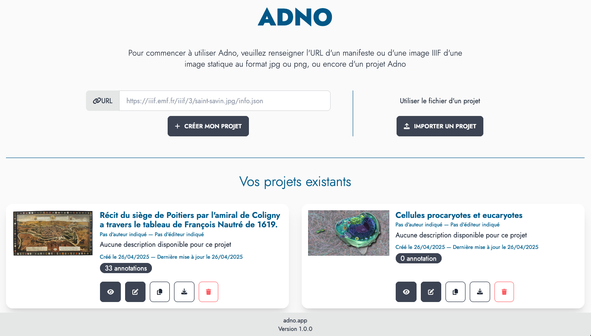

## An online service 

The easiest way to get started is to use the [online service](https://w.adno.app). It is free and does not require registration. You can also start with [an example](/example).

<a href="https://w.adno.app" target="_blank"><button type="button" class="btn btn-primary">Get started!</button></a>
<a href="/example" target="_blank"><button type="button" class="btn btn-success">Examples</button></a>

As Adno is free software, you can also install it for yourself and others. The sources and installation instructions are available on [Github](https://github.com/adnodev/adno).


Adno is under development, its features and interface are subject to change.


## Starting a project 

The Adno home screen is divided into three areas.

The first is a simple form, the second, next to it, allows you to load an existing project, and the third, below it, lists the projects stored by the browser.



It allows you to:

- **create a project** by entering the URL of a static image or an IIIF image,
- **import a project** by loading an Adno project file.
- **retrieve a project** a previously created project stored in your browser.


For each existing project in the browser, a series of buttons allows access to the following features:

- **<i class="fa-solid fa-eye"></i> Preview**
- **<i class="fa-solid fa-pen-to-square"></i> Edit**
- **<i class="fa-solid fa-copy"></i> Duplicate**
- **<i class="fa-solid fa-download"></i> Download**
- **<i class="fa-solid fa-trash"></i> Delete**

### Starting with a static image

The image in `png` or `jpg` format must be on the Internet permanently and you must know its address (the URL). Enter this URL in the dedicated field and click on `Create my project`. 

<button class="btn btn-copy"></button>
``` 
https://upload.wikimedia.org/wikipedia/commons/f/f3/Chenille_de_Grand_porte_queue_%28macaon%29.jpg
```

### Starting with an IIIF image

If you want to learn more, you can check out the [IIIF Online workshop](https://training.iiif.io/iiif-online-workshop/) provided by the [IIIF consortium](https://iiif.o) and led by Glen Robson.

You can use :

- the direct url of an IIIF image, it ends with info.json
- the url of a document, a IIIF manifest, however currently only the first image is taken into account.

<button class="btn btn-copy"></button>
```
https://free.iiifhosting.com/iiif/1c8d49343676a04fffcd92979c02e9394e48bac96f590fffbadffc9133cd06b9/info.json
```

<button class="btn btn-copy"></button>
```
https://gallica.bnf.fr/iiif/ark:/12148/btv1b8626777x/f13/info.json
```

### Starting with an example

The [examples page](/en/example/) suggests resources from various domains. 

### Import a project

Use the Import a project button (`Importer un projet`) to upload a previously downloaded Adno file.

## View and edit your project 

The same interface allows you to view and edit a project.

Icon options in the header :

- <i class="fa-solid fa-house"></i> return to the home page and to the list of projects, 
- <i class="fas fa-download"></i> export the current project, 
- <i class="fas fa-file"></i> <i class="fas fa-file-edit"></i> respectively reading and editing of the project metadata, 
- <i class="fas fa-toggle-off"></i> switch from view mode to edit mode, and vice versa.


### Editing interface


To create a new annotation choose an annotation form:


Then select an area on the image by clicking and dragging. The editing interface appears to write the annotation.

To modify the content of an existing annotation, click on it. To resize it, move on the circles at the corners.

Actions to manage each annotation from the annotation list:

- **<i class="fa-solid fa-pen-to-square"></i> Edit** this annotation,
- **<i class="fa-solid fa-bullseye"></i> Focus** on the annotation area,
- **<i class="fa-solid fa-up-long"></i> <i class="fa-solid fa-down-long"></i> Move** the annotation into the list of annotations,
- **<i class="fa-solid fa-trash"></i> Delete** the annotation.

### Viewing interface


- **<i class="fa-solid fa-play"></i> Autoplay** of annotations (see settings), 
- **<i class="fa-solid fa-magnifying-glass-minus"></i> Back** to the beginning of the annotation 
- **<i class="fa-solid fa-arrow-left"></i> Previous annotation**,
- **<i class="fa-solid fa-arrow-right"></i> Next annotation**,
- **<i class="fa-solid fa-expand"></i> fullscreen**,

L'icone **<i class="fa-solid fa-gear"></i>** allows you to adjust some playback settings :

- delay between two annotations (5 seconds by default),
- viewport navigator,
- display the toolbar in full screen mode, 
- display the navigation bar for annotations, 
- always start autoplay at the first annotation, 
- enable image rotation,,
- display the toolbar.

Actions to access each annotation from the annotation list: 

- **<small>READ MORE</small> <i class="fa-solid fa-circle-plus"></i> View** the annotation content in a modal window, 
- **<i class="fa-solid fa-bullseye"></i> Focus** on the annotation area,

## Retrieving your projects 

Projects are stored in the local storage of your browser. You will be able to find them by reopening a session on the site from which they were created.


In private browsing projects are "forgotten" when you close your session. The same can happen with a restrictive setting of your browser.


## Publishing your projects

You can insert your Adno project into your web pages. To do this, you have to put your project file online and insert an `iframe` tag in your page by adjusting the parameters below.

```
<iframe
    src="https://r.adno.app/#/embed?url=URL HERE"
    height="600px"
    width="100%"
    allow="fullscreen"
></iframe>

```

Note that by inserting the URL of an IIIF or non-IIIF image, or an IIIF manifest, you can obtain an IIIF viewer.

## Help 

Check the frequently asked questions and the documentation to learn more (beware! these parts are still incomplete). If you have any problems or suggestions, please [contact us](/contact).

