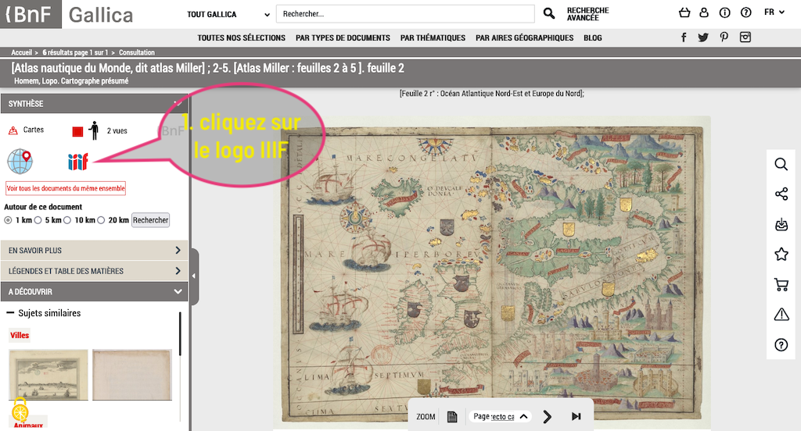
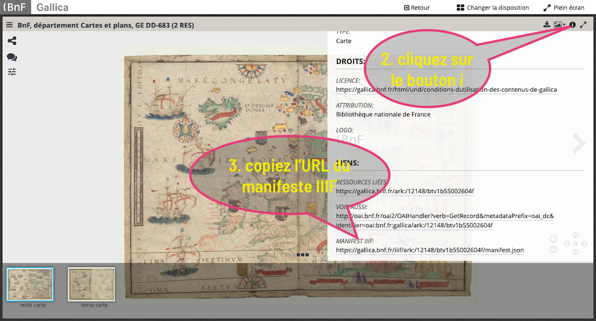

Gallica est la bibliothèque numérique de la Bibliothèque nationale de France et de ses partenaires. Elle propose à la consultation en ligne des millions de documents. Ils sont accessibles en IIIF. 

Cependant, les URL des manifestes ou des images ne sont pas directement récupérables. Le logo IIIF renvoie à un visualiseur IIIF et il faut accéder au volet d'information pour récupérer le lien utilisable dans Adno.

À partir de la page de visualisation d'un document, cliquez sur le logo IIIF.

Puis, cliquez sur le pictogramme d'affichage des métadonnées en haut à droite du visualiseur, la lettre i sur un rond noir. Le volet des métadonnées s'ouvre alors. L'URL à récupérer se trouve tout en bas sous le libellé MANIFEST IIIF.  

Un univers très riche s'ouvre à vous. 
