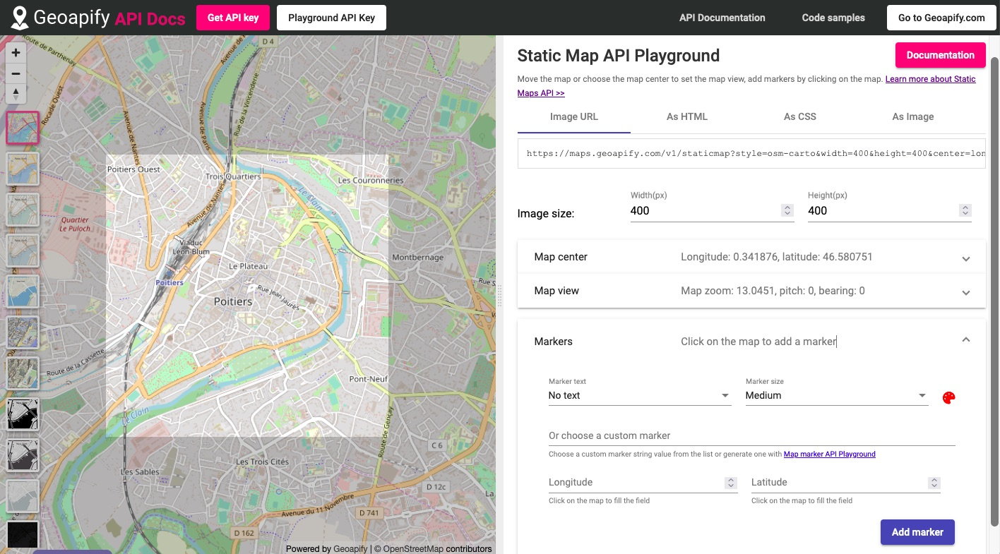
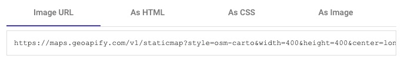
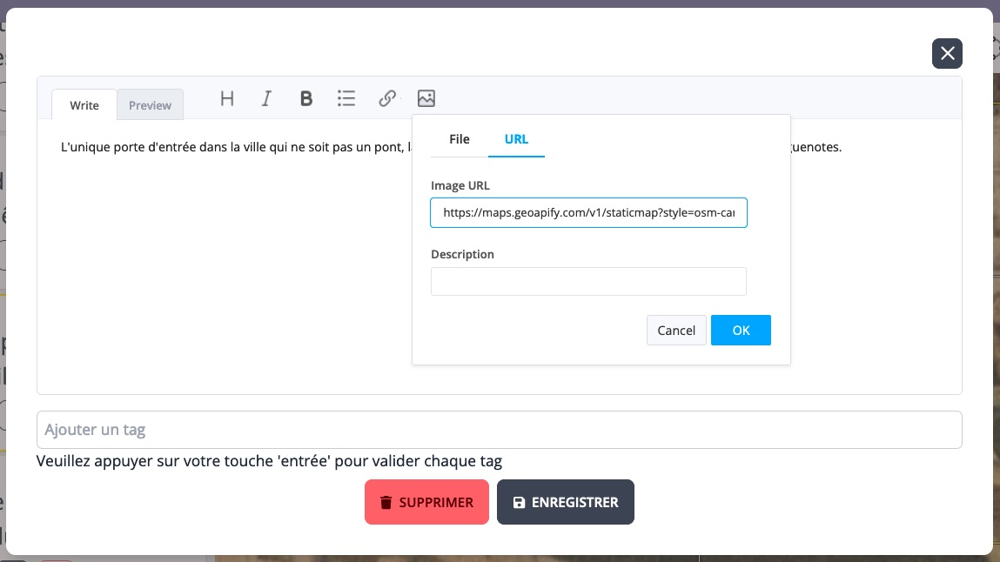
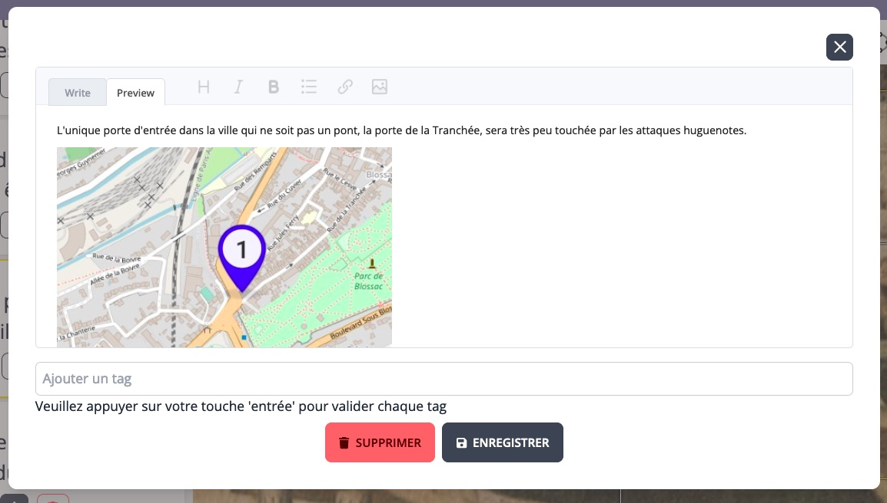
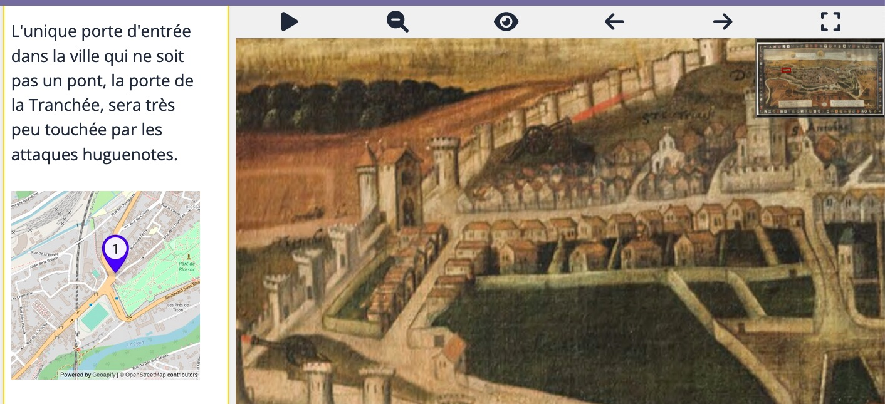

Il est intéressant de pouvoir insérer un détail d'une carte contemporaine dans une annotation par exemple pour indiquer une correspondance sur une cartes ancienne ou sur une vue géographique, ou bien encore pour apporter une information visuelle complémentaire.

Une façon simple de le faire est d'utiliser le service en ligne [Geoapify](https://geoapify.com)[^1].

[Static Map API](https://www.geoapify.com/static-maps-api) est l'une des nombreuses fonctionnalités que propose [Geoapify](https://geoapify.com). Ce service est payant, cependant il propose une offre gratuite avec des quotas convenables[^2] et qui ne nécessite pas de fournir de données bancaires.

Il faut donc commencer par ouvrir un compte sur [Geoapify](https://geoapify.com), puis créer une clé d'API qui sera utilisée pour autoriser la génération à la volée des cartes. Pour chaque carte, l'URL générée sera à insérer comme une image lors de l'édition.

## Obtenir une clé 

Vous devez vous connecter à votre compte [Geoapify](https://geoapify.com) et créer un projet, bouton `Add a new project`. Puis :

- indiquez un nom à ce projet,
- récupérez la clé.

## Créer une image de carte 

Rejoignez l'outil dédié [Static Map API Playground](https://apidocs.geoapify.com/playground/static-maps/).

- réglez les dimensions de l'image et éventuellement changez le style du fond de carte,
- centrez la zone d'intérêt dans le champ de votre image (partie claire),
- le cas échéant ajoutez des marqueurs,
- récupérez l'url de l'image sans oublier d'ajouter votre propre clé à la fin (à la place de `YOUR_API_KEY`).

## Insérer l'image de la carte dans une annotation

Lors de l'édition, sélectionnez le bouton d'insertion d'une image. Cliquez ensuite sur l'onglet URL et insérez l'url produite précédemmment (avec sa clé ajoutée).

Edition :

Visualisation :

Résultat :

[^1]: Geoapify GmbH est une entreprise allemande, située à Gersthofen en Bavière.
[^2]: 3000 crédits par jour. À l'usage, seulement quelques crédits sont consommés pour la réalisation de la carte (ajustement de la zone, création des marqueurs) puis un crédit à chaque appel de la carte pour la visualisation. 

