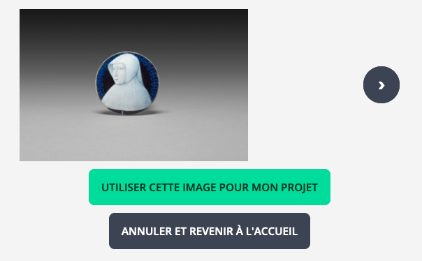
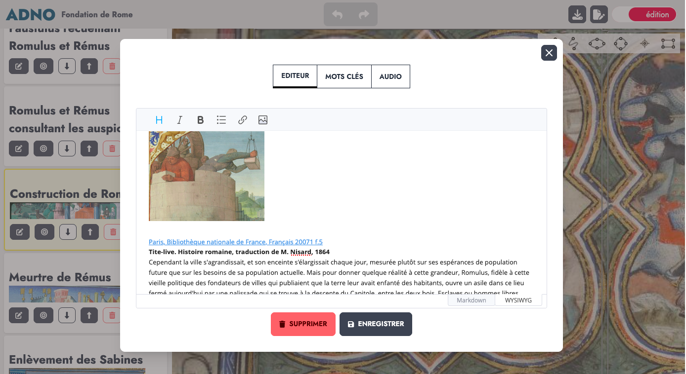

## Une application en ligne

Le plus simple pour commencer est d'utiliser [l'application en ligne](https://w.adno.app) du projet. Elle est gratuite et ne nécessite pas d'inscription. Vous pouvez aussi partir [d'un exemple](/example).

<a href="https://w.adno.app" target="_blank"><button type="button" class="btn btn-primary">Essayer maintenant !</button></a>
<a href="/example" target="_blank"><button type="button" class="btn btn-success">Exemples</button></a>

Comme Adno est un logiciel libre, vous pouvez aussi l'installer pour vous-même et les autres. Les sources et les instructions d'installation sont accessibles sur [Github](https://github.com/adnodev/adno).


Adno est en cours de développement, ses fonctionnalités et son interface sont susceptibles de changer.


## Débuter un projet 

L'écran d'accueil de Adno de partage en trois zones. 

La première se présente sous la forme d'un simple formulaire, la deuxième, à côté, permet de charger un projet existant, enfin, la troisième, en dessous, liste les projets gardés en mémoire par le navigateur. 


Il est donc possible :

- **de créer un projet** en entrant l'URL d'une image statique ou d'une image IIIF,
- **d'importer un projet** en chargeant le fichier d'un projet Adno. 
- **de récupérer un projet** précédemment créé et mémorisé dans votre navigateur. 


Pour chaque projet existant dans le navigateur, une série de boutons permet d'accèder aux fonctionnalités suivantes :

- **<i class="fa-solid fa-eye"></i> Prévisualiser** 
- **<i class="fa-solid fa-pen-to-square"></i> Éditer** 
- **<i class="fa-solid fa-copy"></i> Dupliquer** 
- **<i class="fa-solid fa-download"></i> Télécharger** 
- **<i class="fa-solid fa-trash"></i> Supprimer**  

### Partir d'une image statique

L'image au format `png` ou `jpg` doit être présente en permanence sur Internet et vous devez connaitre son adresse (l'URL). Entrez cette URL dans le champ dédié puis cliquez sur `Créer mon projet`.
 
<button class="btn btn-copy"></button>
``` 
https://upload.wikimedia.org/wikipedia/commons/f/f3/Chenille_de_Grand_porte_queue_%28macaon%29.jpg
```

### Partir d'une ressource IIIF

Si vous ne connaissez pas IIIF, consultez cette [page de présentation](https://doc.biblissima.fr/iiif/introduction-iiif/) issue de la [formation à IIIF créé par Régis Robineau](https://doc.biblissima.fr/formation-iiif/) dans le cadre de Biblissima.

Vous pouvez utiliser :

#### Un manifeste IIIF

C'est une URL qui est fournie par le diffuseur du document. Le manifeste décrit le document avec ses métadonnées et les images qu'il contient.

<button class="btn btn-copy"></button>
```
https://api.artic.edu/api/v1/artworks/251131/manifest.json
```
Si il y a plusieurs images, sélectionnez en une.



Vosu avez aussi la possibilité de récupérer l'URL `info.json` de chaque image présente dans le manifeste en utilisant ce [formulaire](/fr/blog/comment-extraire-les-images-dun-manifeste).

#### Une image IIIF

Vous utilisez alors l'url directe d'une image IIIF, elle se termine par `info.json`

<button class="btn btn-copy"></button>
```
https://gallica.bnf.fr/iiif/ark:/12148/btv1b8626777x/f13/info.json
```

### Partir d'un exemple

La [page des exemples](/fr/example/) propose, pour commencer, des ressources issues des domaines les plus divers. 

### Importer un projet 

Utilisez le bouton `Importer un projet` pour teléverser un fichier Adno préalablement téléchargé.

## Visualiser et éditer son projet 

La même interface vous permet de visualiser et d'éditer un projet. 

Fonctions des icônes de l'entête :

- **<i class="fa-solid fa-house"></i>** retour à la page d'accueil et à la liste des projets, 
- **<i class="fas fa-download"></i>** exportation du projet courant, 
- **<i class="fas fa-file"></i>** <i class="fas fa-file-edit"></i> respectivement lecture et édition des métadonnées du projet 
- **<i class="fas fa-toggle-off"></i>** passage du mode visualisation au mode édition, et inversement.

### Interface de visualisation


- **<i class="fa-solid fa-play"></i>** / **<i class="fa-solid fa-pause"></i> Lecture automatique** / **Pause** 
- **<i class="fa-solid fa-magnifying-glass-minus"></i> Retour** au début de la lecture des annotations, 
- **<i class="fa-solid fa-eye"></i>** / **<i class="fa-solid fa-eye-slash"></i> Afficher** / **Masquer** les contours des annotations, 
- **<i class="fa-solid fa-arrow-left"></i> Annotation précédente**, 
- **<i class="fa-solid fa-arrow-right"></i> Annotation suivante**, 
- **<i class="fa-solid fa-expand"></i> Plein écran**,
- **<i class="fa-solid fa-question"></i> Aide**.

Des raccourcis clavier facilitent l'accessibilité :

- `p` ou `P` : lance la lecture automatique, 
- `e` ou `E` : bascule en plein écran ou retour,
- `s` ou `S` : montre ou pas les délimitations des annotations,
- `t` ou `T` : montre ou pas les boutons,
- <code><i class="fa-solid fa-arrow-left"></i></code> et <code><i class="fa-solid fa-arrow-right"></i></code> passer de l'annotation courante à la précédente ou à la suivante.  
  
L'icone **<i class="fa-solid fa-gear"></i>** permet de régler quelques paramètres de lecture : 

- Visualisation
  - navigateur d'ensemble, 
  - afficher la barre d'outils.
  - afficher la barre d'outils en mode plein écran,
  - afficher la barre de navigation pour les annotations.
- Navigation
  - délai de passage entre deux annotations (5 secondes par défaut),
  - toujours commencer la lecture automatique à la première annotation,
  - afficher les contours des annotations,
  - afficher une icone à l'intérieur des annotations, 
  - mode pour le rendu des audio 
  - activer la rotation de l'image.
- Annotation
  - sélection des annotations à afficher en fonction d'un ou plusieurs mots clés, 
  - épaisseur des annotation,
  - couleurs des contours des annotations. 

Actions pour accèder à chaque annotation depuis la liste des annotations :

- **<small>VOIR</small> <i class="fa-solid fa-circle-plus"></i> Visualiser** le contennu de l'annotation dans une fenêtre modale, 
- **<i class="fa-solid fa-bullseye"></i> Focus** sur la zone de l'annotation,

### Interface d'édition


Pour créer une nouvelle annotation choisissez une forme d'annotation :

 

Puis sélectionnez une zone sur l'image en effectuant un cliquer-glisser. L'interface d'édition apparait ensuite pour rédiger l'annotation.

Pour modifier le contenu d'une annotation existante, cliquez dessus. Pour la redimensionner, agisser sur les ronds aux angles.

Actions pour gérer chaque annotation depuis la liste des annotations :

- **<i class="fa-solid fa-pen-to-square"></i> Éditer** cette annotation, 
- **<i class="fa-solid fa-bullseye"></i> Focus** sur la zone de l'annotation,
- **<i class="fa-solid fa-up-long"></i> <i class="fa-solid fa-down-long"></i> Déplacer** l'annotation dans la liste des annotations,
- **<i class="fa-solid fa-trash"></i> Supprimer** l'annotation. 

### Éditer une annotation



Le contenu d'une annotation est généralement un court texte. Il est cependant possible d'insérer du contenu enrichi et d'associer des mots-clés et un fichier audio à chaque annotation. 

Deux modes d'éditions sont disponibles : 

- [WYSIWYG](https://fr.wikipedia.org/wiki/What_you_see_is_what_you_get) avec des icones (niveaux de titres, italique, gras, liste à puces, lien hypertexte, image),
- [Markdown](https://fr.wikipedia.org/wiki/Markdown) un système léger de balisage du texte, c'est de cette façon que le contenu des annotations est représenté.   

Le champ suivant permet d'associer un ou plusieurs mots clés à chaque annotation. Ne pas oublier de taper sur la touche `Entrée` après avoir saisi chaque mot clé.   

Les deux champs suivants sont consacrés à une ressources audio, le premier champ reçoit l'URL du fichier audio et le second des informations sur cette ressources (crédit ou autre).

## Retrouver ses projets 

Les projets sont conservés dans votre navigateur. Vous pourrez les retrouver en rouvrant une session sur le site à partir duquel ils ont été créés. 


En navigation privée les projets sont "oubliés" à la fermeture de la session. Il peut en être de même avec un paramétrage restrictif de votre navigateur. 


## Partager ses projets

Commencez par télécharger votre projet Adno. Il se présente sous la forme d'un simple fichier texte au [format json](https://json.org/json-fr.html).

Ce fichier est en général très léger. Vous pouvez donc facilement le transmettre par mail. Après l'avoir importé dans Adno, votre correspondant pourra le visualiser mais aussi proposer des variantes ou des corrections à votre projet. 

Vous pouvez aussi déposer votre fichier en ligne et diffuser son URL. Pour ce faire, il est possible d'utiliser un site web ou un serveur de fichiers. Le protocole IPFS offre une alternative décentralisée intéressante. 

Consultez les pages [Google Drive](/fr/docs/references/gdrive/), [Dropbox](/fr/docs/references/dropbox/) ou [IPFS](/fr/docs/references/ipfs/) du guide de référence de la documentation pour découvrir comment procéder avec ces services pour déposer des images, des manifestes IIIF ou des projets Adno.

Dès lors que votre projet Adno est en ligne, il est possible de le rendre visible dans une page web en insérant une balise `iframe` en ajustant les paramètres ci-après. 

```
<iframe 
    src="https://w.adno.app/#/embed?url=METTRE l'URL ICI" 
    height="600px" 
    width="100%"
    allow="fullscreen"
></iframe>

```

À noter qu'en insérant l'URL d'une image IIIF ou non, ou d'un manifeste IIIF, vous pouvez ainsi disposer d'un visualiseur IIIF facile à installer.

Il est aussi possible d'utiliser le composant [Adno views tags](https://github.com/adnodev/adno-views-tag) pour disposer de différents types de visualisations (listes, diapos, etc.). 

## Difficultés 

Adno est une application en ligne qui utilise des ressources externes en ligne elles aussi. Cette façon de faire peut être soumise à des restrictions qui peuvent impacter le fonctionnemet Adno et de son intégration dans des pages web. 

Les cas les plus fréquents : 

- Il n'est pas possible d'insérer une ressources désignées par une adresse débutant par `http` dans un site sécurisé accessible en `https`. Par exemple, si vous déposez une image sur le service [IIIFHosting](http://iiifhosting.com/), l'URL fournie par défaut est en `http`. Pour l'utiliser dans Adno, n'oubliez pas de changer `http` en `https` au début de l'URL.
- Des [paramétrages CORS](/fr/docs/references/cors/) sur un serveur tiers interdisent le transfert de données vers un autre domaine. L'instance officielle de Adno utilise un contournement.

## Installation

Adno est une service disponible librement et gratuitement en ligne. Adno est aussi un logiciel libre, vous pouvez donc l'installer chez vous voire l'adapter à vos besoins. Vous retrouverez toutes les infos sur la [forge logicielle de Adno](https://github.com/adnodev/adno).
 
## Aide 

Consultez la foire aux question et la documentation pour en savoir plus (attention ! ces parties sont encore incomplètes). 
En cas de problème ou de suggestion n'hésitez à [nous contacter](/contact).

