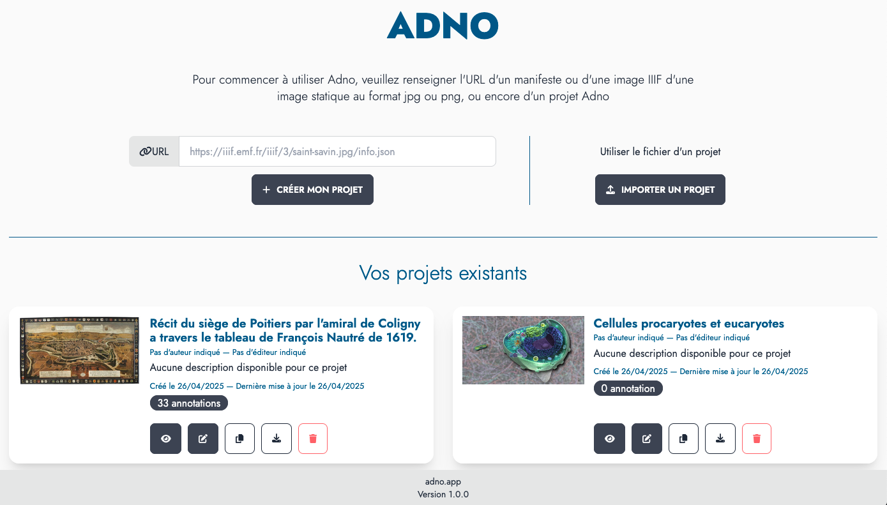
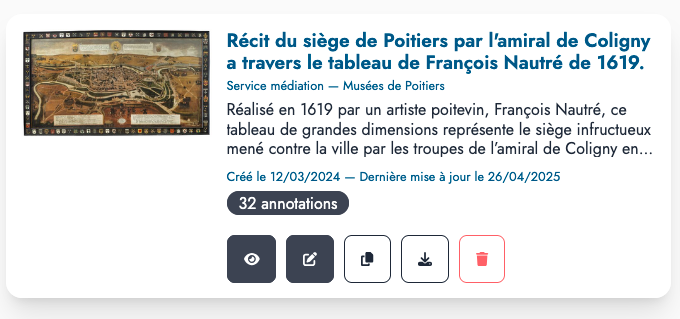

## Un service en ligne

Le plus simple pour commencer est d'utiliser [le service en ligne](https://w.adno.app) du projet. Il est gratuit et ne nécessite pas d'inscription. Vous pouvez aussi partir [d'un exemple](/example).

<a href="https://w.adno.app" target="_blank"><button type="button" class="btn btn-primary">Essayer maintenant !</button></a>
<a href="/example" target="_blank"><button type="button" class="btn btn-success">Exemples</button></a>

Comme Adno est un logiciel libre, vous pouvez aussi l'installer pour vous-même et les autres. Les sources et les instructions d'installation sont accessibles sur [Github](https://github.com/adnodev/adno).


Adno est en cours de développement, ses fonctionnalités et son interface sont susceptibles de changer.


## Débuter un projet 

L'écran d'accueil de Adno de partage en trois zones. 

La première se présente sous la forme d'un simple formulaire, la deuxième, à côté, permet de charger un projet existant, enfin, la troisième, en dessous, liste les projets gardés en mémoire par le navigateur. 



Il est donc possible :

- **de créer un projet** en entrant l'URL d'une image statique ou d'une image IIIF,
- **d'importer un projet** en chargeant le fichier d'un projet Adno. 
- **de récupérer un projet** précédemment créé et mémorisé dans votre navigateur. 



Pour chaque projet existant dans le navigateur, une série de boutons permet d'accèder aux fonctionnalités suivantes :

- **<i class="fa-solid fa-eye"></i> Prévisualiser** 
- **<i class="fa-solid fa-pen-to-square"></i> Éditer** 
- **<i class="fa-solid fa-copy"></i> Dupliquer** 
- **<i class="fa-solid fa-download"></i> Télécharger** 
- **<i class="fa-solid fa-trash"></i> Supprimer**  

### Partir d'une image statique

L'image au format `png` ou `jpg` doit être présente en permanence sur Internet et vous devez connaitre son adresse (l'URL). Entrez cette URL dans le champ dédié puis cliquez sur `Créer mon projet`.
 
<button class="btn btn-copy"></button>
``` 
https://upload.wikimedia.org/wikipedia/commons/f/f3/Chenille_de_Grand_porte_queue_%28macaon%29.jpg
```

### Partir d'une image IIIF

Si vous ne connaissez pas IIIF, consultez cette [page de présentation](https://doc.biblissima.fr/iiif/introduction-iiif/) issue de la [formation à IIIF créé par Régis Robineau](https://doc.biblissima.fr/formation-iiif/) dans le cadre de Biblissima.

Vous pouvez utiliser :

- l'url directe d'une image IIIF, elle se termine par `info.json`
- l'url d'un document, un manifeste IIIF, cependant actuellement seule la première image est prise en compte. 

<button class="btn btn-copy"></button>
```
https://free.iiifhosting.com/iiif/1c8d49343676a04fffcd92979c02e9394e48bac96f590fffbadffc9133cd06b9/info.json
```

<button class="btn btn-copy"></button>
```
https://gallica.bnf.fr/iiif/ark:/12148/btv1b8626777x/f13/info.json
```

### Partir d'un exemple

La [page des exemples](/fr/example/) propose, pour commencer, des ressources issues des domaines les plus divers. 

### Importer un projet 

Utilisez le bouton `Importer un projet` pour teléverser un fichier Adno préalablement téléchargé.

## Visualiser et éditer son projet 

La même interface vous permet de visualiser et d'éditer un projet. 

Fonctions des icônes de l'entête :

- **<i class="fa-solid fa-house"></i>** retour à la page d'accueil et à la liste des projets, 
- **<i class="fas fa-download"></i>** exportation du projet courant, 
- **<i class="fas fa-file"></i>** <i class="fas fa-file-edit"></i> respectivement lecture et édition des métadonnées du projet 
- **<i class="fas fa-toggle-off"></i>** passage du mode visualisation au mode édition, et inversement.


### Interface d'édition


Pour créer une nouvelle annotation choisissez une forme d'annotation :

 

Puis sélectionnez une zone sur l'image en effectuant un cliquer-glisser. L'interface d'édition apparait ensuite pour rédiger l'annotation.

Pour modifier le contenu d'une annotation existante, cliquez dessus. Pour la redimensionner, agisser sur les ronds aux angles.


Actions pour gérer chaque annotation depuis la liste des annotations :

- **<i class="fa-solid fa-pen-to-square"></i> Éditer** cette annotation, 
- **<i class="fa-solid fa-bullseye"></i> Focus** sur la zone de l'annotation,
- **<i class="fa-solid fa-up-long"></i> <i class="fa-solid fa-down-long"></i> Déplacer** l'annotation dans la liste des annotations,
- **<i class="fa-solid fa-trash"></i> Supprimer** l'annotation. 
 


### Interface de visualisation


- **<i class="fa-solid fa-play"></i> Lecture automatique** des annotations (voir paramètres), 
- **<i class="fa-solid fa-magnifying-glass-minus"></i> Retour** au début de la lecture des annotations, 
- **<i class="fa-solid fa-arrow-left"></i> Annotation précédente**, 
- **<i class="fa-solid fa-arrow-right"></i> Annotation suivante**, 
- **<i class="fa-solid fa-expand"></i> Plein écran**,

L'icone **<i class="fa-solid fa-gear"></i>** permet de régler quelques paramètres de lecture : 

- délai de passage entre deux annotations (5 secondes par défaut),
- navigateur d'ensemble, 
- afficher la barre d'outils en mode plein écran,
- afficher la barre de navigation pour les annotations,
- toujours commencer la lecture automatique à la première annotation,
- activer la rotation de l'image,
- afficher la barre d'outils.


Actions pour accèder à chaque annotation depuis la liste des annotations :

- **<small>VOIR</small> <i class="fa-solid fa-circle-plus"></i> Visualiser** le contennu de l'annotation dans une fenêtre modale, 
- **<i class="fa-solid fa-bullseye"></i> Focus** sur la zone de l'annotation,

## Retrouver ses projets 

Les projets sont conservés dans votre navigateur. Vous pourrez les retrouver en rouvrant une session sur le site à partir duquel ils ont été créés. 


En navigation privée les projets sont "oubliés" à la fermeture de la session. Il peut en être de même avec un paramétrage restrictif de votre navigateur. 


### Aide 

Consultez la foire aux question et la documentation pour en savoir plus (attention ! ces parties sont encore incomplètes). 
En cas de problème ou de suggestion n'hésitez à [nous contacter](/contact).

