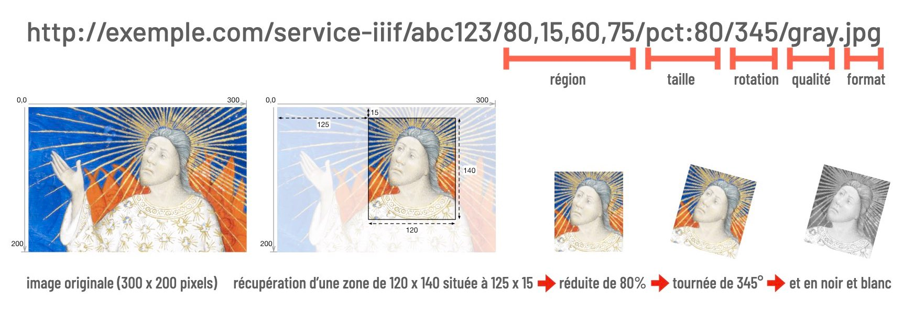
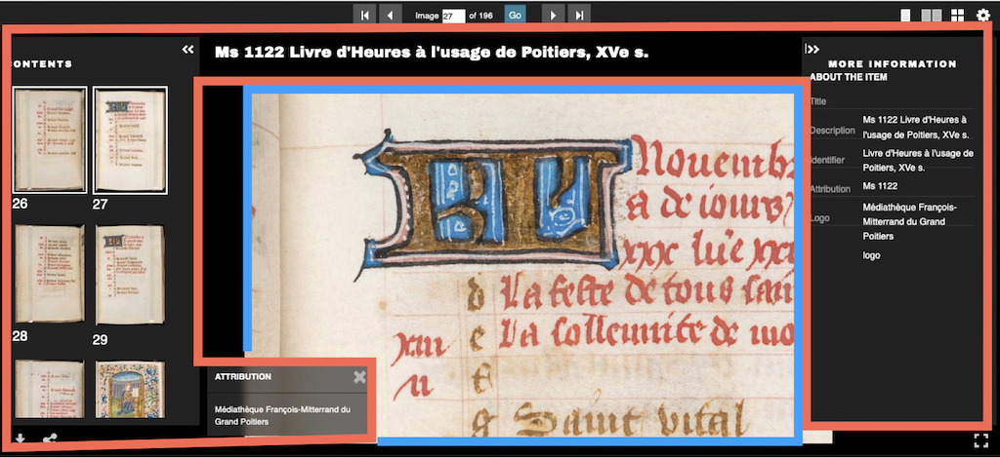

L’initiative [IIIF](https://iiif.io/), pour International Image Interoperability Framework, a vu le jour en réponse au constat que la diffusion d’images patrimoniales sur le web était « trop lente, trop coûteuse, trop décousue, trop complexe ». [IIIF](https://iiif.io/) apporte une solution pérenne et élégante à ces difficultés en conciliant interopérabilité, sobriété et accessibilité.

Elle a été lancée en 2010 par l'université de Stanford et par plusieurs grandes bibliothèques. Le [Consortium IIIF](https://iiif.io/community/consortium) a été créé en 2015 par onze institutions : la British Library, Artstor, Die Bayerische Staatsbibliothek, La Bibliothèque Nationale de France, Nasjonalbiblioteket (Norvège), Wellcome Trust, et les universités d'Oxford, Stanford, Cornell, Princeton et Yale. Il compte actuellement une soixantaine de membres.

## Qu’est-ce que IIIF ?

[IIIF](https://iiif.io/) fait référence à la fois à un cadre technique partagé et à une communauté humaine qui le met en œuvre, développe des logiciels et, finalement, expose des contenus audiovisuels interopérables.

Ce standard _de facto_ est des plus en plus utilisé par des institutions culturelles ou scientifiques. Ses fonctionnalités s’étendent désormais à l’audio et à la vidéo ; la prise en charge de la 3D est en cours de développement par deux groupes de travail au sein du Consortium. 

Pour l'heure [IIIF](https://iiif.io/) est surtout utilisé pour la diffusion d'images numériques. Ce sont ainsi des centaines de millions d’images qui deviennent véritablement découvrables, consultables, comparables, manipulables, citables, annotables et mixables par n’importe quelle application compatible capable de se « brancher » sur les entrepôts des uns et des autres. Ces ressources de « première main » sont immédiatement utilisables par les professionnels comme par les amateurs. Elles intéressent aussi les chercheurs, les enseignants et les élèves, et les médiateurs culturels, scientifiques et artistiques. [IIIF](https://iiif.io/) facilite grandement la réutilisation et la valorisation de toutes ces ressources disséminées.

## Un exemple de bibliothèque virtuelle

La magie IIIF réside dans cette capacité à jongler avec les références des ressources pour les réunir dans des bibliothèques virtuelles ou autres aggrégateurs ou visualiseurs.

[Léonard Limosin](https://fr.wikipedia.org/wiki/L%C3%A9onard_Limosin) est un peintre, émailleur, dessinateur et graveur français du XVIe. Deux de ses œuvres sont présentées ci-après dans le visualiseur libre IIIF [Mirador](https://projectmirador.org).

- [Médaillon, Art institute of Chicago](https://www.artic.edu/artworks/251131/medallion-probably-margaret-of-lorraine-recto-the-virgin-seated-on-a-throne-before-two-widows-verso), à gauche.
- [Portrait présumé de Jeanne d'Albret, Musées de la ville de Paris](https://www.parismuseescollections.paris.fr/en/node/221423), à droite

<iframe allowfullscreen="" height="500px" src="https://tools.mexina.fr/mirador/index.html" style="border:none" width="100%"></iframe>

Vous pouvez explorer chaque image et zoomer, les comparer, lire leurs métadonnées, passer en plein écran ou agencer différemment les fenêtres. L'interface de [Mirador](https://projectmirador.org) vous permet aussi d'accéder à d'autres références en cliquant sur le bouton rond bleu puis en sélectionnant les documents préenregistrées. 

Vous avez également la possibilitè d'en ajouter d'autres via le bouton bleu `Ajouter une ressource` en bas à droite puis en insérant l'URL d'un manifeste  IIIF. En faisant une recherche sur [Léonard Limosin](https://fr.wikipedia.org/wiki/L%C3%A9onard_Limosin) vous trouverez différentes collections comportant certaines de ses œuvres exposées au standard IIIF. Chaque notice comporte alors — souvent relégué dans la partie informations détaillées — le lien d'un manifeste IIIF parfois associé au logo IIIF. 

Le logiciel libre [Omeka](https://omeka.org/) permet de créer des bibliothèques virtuelles de ressources IIIF. 

## Autres exemples 

- Zoom profond : [Ōmi Kuni-ezu -- 近江國絵圖](https://purl.stanford.edu/hs631zg4177).
- Visualisation multiple [_River scene with a bridge in the distance_](https://data.fitzmuseum.cam.ac.uk/id/object/13917) de Turner.
- Comparaison, vues multispectrales : [_David Gives Uriah a Letter for Joab_, Pieter Lastman, 1619](https://www.theleidencollection.com/viewer/david-and-uriah/).
- Reconstitution : [manuscrit 5 de la Bibliothèque municipale de Châteauroux](https://demos.biblissima.fr/chateauroux/demo/).
- Annotations et recherche : [Welsh Newspapers](https://newspapers.library.wales/view/3466576/3466580/73).
- Explorations guidées : 
  - [Storiiies](http://storiiies.cogapp.com/) et son [editeur](https://storiiies-editor.cogapp.com/),
  - [Exhibit](https://www.exhibit.so/), 
  - [Adno](https://adno.app).
- [audio et video](https://ddmal.music.mcgill.ca/IIIF-AV-player/).
- [Puzzle](http://puzzle.mikeapps.me/).
- Visualiseurs : 
  - [Mirador](https://projectmirador.org/),
  - [Universal Viewer](https://universalviewer.io/),
  - [Openseadragon](https://openseadragon.github.io/examples/tilesource-iiif/).

## Comment ça marche ?

Le manifeste est un élément essentiel de IIIF. C'est un document textuel au format `json` qui représente généralement un objet physique numérisé tel qu'un livre, une œuvre d'art, un numéro de journal, etc. Il décrit l'ensemble du document, ses métadonnées, les ressources qu'il embarque et sa structure.

Les liens des manifestes IIIF, sont plus ou moins faciles à trouver dans les notices des catalogues. Une méthode simple consiste à rechercher le logo IIIF ou à explorer les informations fournies par les visualiseurs.

Techniquement, IIIF comporte deux API (interface de programmation applicative) principales : 

- **API image** fournit des informations sur l'image ainsi que les pixels de l'image entière ou de zones à la demande. Elle comporte
  - accès aux informations techniques d'une image, `abc123` est un exemple d'identifiant : 
`http://exemple.com/service-iiif/abc123/info.json` 
  - récupération et manipulation d'une image en passant les paramètres via l'url : 

- **API présentation** fournit les propriétés d'un document IIIF : métadonnées, structures, annotations, etc. 
- [Manifeste](https://purl.stanford.edu/ff139pd0160) et [info.json](https://stacks.stanford.edu/image/iiif/ff139pd0160/K90113-43/info.json) de l'image test.

Il est donc possible d'utiliser l'API IIIF Image pour afficher une image seule.

|  |
|:--:| 
| <small> https://stacks.stanford.edu/image/iiif/hg676jb4964%2F0380_796-44/1015,1460,799,824/pct:25/0/default.jpg </small> |
| <small>L'URL de cette photographie de Martin Luther King est fournie par l'université de Stanford.</small> |

Ou bien un ouvrage entier avec un manifeste et un visualiseur. On distingue alors dans différentes zones le rôle de chacune des deux API principales. À noter que le visualiseur optimise le trafic en ne demandant au serveur que la partie de l'image à afficher.

|  |
|:--:| 
| <small> Un exemple dans [Universal Viewer](https://universalviewer.io/), un autre visualiseur libre. Ms 1122 Livre d'Heures à l'usage de Poitiers, XVes, Médiathèques de Poitiers, [projet Horae Pictavenses](https://horae-pictavenses.fr/s/hp/page/accueil). </small>|

## Pour en savoir plus

- [Site officiel IIIF](https://biblissima.fr/), en anglais. 
- [Documentation IIIF en français](https://portail.biblissima.fr/fr/info-iiif) éditée par [Biblissima](https://biblissima.fr/)
- [formation IIIF](https://doc.biblissima.fr/formation-iiif/) créée par Régis Robineau dans le cadre de Biblissima.
- [Catalogue de ressources IIIF](https://github.com/IIIF/awesome-iiif) proposées par la communauté.

